# IVT Filter - Class Architecture

This document provides an overview of the refactored class architecture following SOLID principles.

## Class Diagram

```mermaid
classDiagram
    %% Data Extraction Layer
    class TobiiDataExtractor {
        -column_mapping: Dict
        -timestamp_detector: TimestampUnitDetector
        +extract(input_path, output_path, timestamp_unit)
        -_read_data(path) DataFrame
        -_filter_sensor(df) DataFrame
        -_build_slim_dataframe(df, unit) DataFrame
        -_convert_timestamps(source, target, unit) DataFrame
        -_map_columns(source, target) DataFrame
        -_sort_by_time(df) DataFrame
        -_write_data(df, path)
    }

    class TimestampUnitDetector {
        -alternatives: list[str]
        +detect_column(df) tuple[str, str]
        +convert_to_milliseconds(values, unit) Series
        -_parse_unit_from_column_name(col_name) str
    }

    TobiiDataExtractor --> TimestampUnitDetector : uses

    %% Pipeline Layer (NEW)
    class IVTPipeline {
        -velocity_config: OlsenVelocityConfig
        -classifier_config: IVTClassifierConfig
        -saccade_merge_config: SaccadeMergeConfig
        -fixation_post_config: FixationPostConfig
        +run(input_path, output_path, ...) DataFrame
        -_apply_classification(df) DataFrame
        -_apply_saccade_smoothing(df, col, ms) DataFrame
        -_apply_fixation_postprocessing(df, col) DataFrame
        -_generate_plots(df, with_events)
    }

    class ConfigBuilder {
        +build_velocity_config(args)$ OlsenVelocityConfig
        +build_classifier_config(args)$ IVTClassifierConfig
        +build_saccade_merge_config(args)$ SaccadeMergeConfig
        +build_fixation_post_config(args)$ FixationPostConfig
        +build_all_configs(args)$ tuple
    }

    %% Velocity Computation Layer (NEW)
    class VelocityComputer {
        -cfg: OlsenVelocityConfig
        -sampling_analyzer: SamplingAnalyzer
        +compute(df) DataFrame
        -_prepare_dataframe(df) DataFrame
        -_extract_data_arrays(df) dict
        -_print_strategy_info(...)
        -_compute_all_velocities(...) DataFrame
    }

    class SamplingAnalyzer {
        -cfg: OlsenVelocityConfig
        +NOMINAL_RATES$: list[float]
        +analyze(times) tuple[float, OlsenVelocityConfig]
        -_extract_time_differences(times, n) ndarray
        -_calculate_dt_statistic(dt) float
        -_print_sampling_info(dt, hz, n)
        -_auto_convert_window(dt) OlsenVelocityConfig
    }

    VelocityComputer --> SamplingAnalyzer : uses

    %% Classification Layer
    class IVTClassifier {
        -cfg: IVTClassifierConfig
        -sample_validator: SampleValidator
        -velocity_validator: VelocityValidator
        +classify(df) DataFrame
        -_classify_sample(row) str
    }

    class SampleValidator {
        +is_invalid(val)$ bool
        +is_valid(row) bool
    }

    class VelocityValidator {
        +parse_velocity(value)$ Optional~float~
    }

    IVTClassifier --> SampleValidator : uses
    IVTClassifier --> VelocityValidator : uses

    %% Strategy Pattern: Velocity Calculation
    class VelocityCalculationStrategy {
        <<abstract>>
        +calculate_visual_angle(...)*  float
        +get_description()* str
    }

    class Olsen2DApproximation {
        +DEFAULT_DISTANCE_MM: float
        +calculate_visual_angle(...) float
        +get_description() str
    }

    class Ray3DAngle {
        +DEFAULT_DISTANCE_MM: float
        +calculate_visual_angle(...) float
        +get_description() str
    }

    VelocityCalculationStrategy <|-- Olsen2DApproximation
    VelocityCalculationStrategy <|-- Ray3DAngle

    %% Strategy Pattern: Smoothing
    class SmoothingStrategy {
        <<abstract>>
        -window_samples: int
        +smooth(series, valid_mask)* Series
        +get_description()* str
    }

    class NoSmoothing {
        +smooth(series, valid_mask) Series
        +get_description() str
    }

    class MedianSmoothing {
        +smooth(series, valid_mask) Series
        +get_description() str
    }

    class MovingAverageSmoothing {
        +smooth(series, valid_mask) Series
        +get_description() str
    }

    class MedianSmoothingStrict {
        +smooth(series, valid_mask) Series
        +get_description() str
    }

    class MovingAverageSmoothingStrict {
        +smooth(series, valid_mask) Series
        +get_description() str
    }

    class MedianSmoothingAdaptive {
        -min_samples: int
        -expansion_radius: int
        +smooth(series, valid_mask) Series
        +get_description() str
    }

    class MovingAverageSmoothingAdaptive {
        -min_samples: int
        -expansion_radius: int
        +smooth(series, valid_mask) Series
        +get_description() str
    }

    SmoothingStrategy <|-- NoSmoothing
    SmoothingStrategy <|-- MedianSmoothing
    SmoothingStrategy <|-- MovingAverageSmoothing
    SmoothingStrategy <|-- MedianSmoothingStrict
    SmoothingStrategy <|-- MovingAverageSmoothingStrict
    SmoothingStrategy <|-- MedianSmoothingAdaptive
    SmoothingStrategy <|-- MovingAverageSmoothingAdaptive

    %% Strategy Pattern: Window Selection
    class WindowSelector {
        <<abstract>>
        +select(idx, times, valid, half_window_ms)* tuple
    }

    class TimeSymmetricWindowSelector {
        +select(idx, times, valid, half_window_ms) tuple
    }

    class SampleSymmetricWindowSelector {
        +select(idx, times, valid, half_window_ms) tuple
    }

    class FixedSampleSymmetricWindowSelector {
        -half_size: int
        +select(idx, times, valid, half_window_ms) tuple
    }

    class AsymmetricNeighborWindowSelector {
        +select(idx, times, valid, half_window_ms) tuple
    }

    WindowSelector <|-- TimeSymmetricWindowSelector
    WindowSelector <|-- SampleSymmetricWindowSelector
    WindowSelector <|-- FixedSampleSymmetricWindowSelector
    WindowSelector <|-- AsymmetricNeighborWindowSelector

    %% Strategy Pattern: Window Rounding
    class WindowRoundingStrategy {
        <<abstract>>
        +calculate_half_size(window_size)* int
    }

    class StandardWindowRounding {
        +calculate_half_size(window_size) int
    }

    class SymmetricRoundWindowStrategy {
        +calculate_half_size(window_size) int
    }

    WindowRoundingStrategy <|-- StandardWindowRounding
    WindowRoundingStrategy <|-- SymmetricRoundWindowStrategy

    %% Strategy Pattern: Coordinate Rounding
    class CoordinateRoundingStrategy {
        <<abstract>>
        +round(value)* float
        +get_description()* str
    }

    class NoRounding {
        +round(value) float
        +get_description() str
    }

    class RoundToNearest {
        +round(value) float
        +get_description() str
    }

    class RoundHalfUp {
        +round(value) float
        +get_description() str
    }

    class FloorRounding {
        +round(value) float
        +get_description() str
    }

    class CeilRounding {
        +round(value) float
        +get_description() str
    }

    CoordinateRoundingStrategy <|-- NoRounding
    CoordinateRoundingStrategy <|-- RoundToNearest
    CoordinateRoundingStrategy <|-- RoundHalfUp
    CoordinateRoundingStrategy <|-- FloorRounding
    CoordinateRoundingStrategy <|-- CeilRounding

    %% Configuration Classes
    class OlsenVelocityConfig {
        +window_length_ms: float
        +eye_mode: str
        +max_validity: int
        +smoothing_mode: str
        +smoothing_window_samples: int
        +velocity_method: str
        +coordinate_rounding: str
        ...
    }

    class IVTClassifierConfig {
        +velocity_threshold_deg_per_sec: float
    }

    class SaccadeMergeConfig {
        +max_saccade_block_duration_ms: float
        +require_fixation_context: bool
        +use_sample_type_column: Optional~str~
    }

    class FixationPostConfig {
        +min_fixation_duration_ms: float
        +merge_max_gap_ms: float
        +merge_max_angle_deg: float
        +discard_no_saccade_context: bool
    }

    %% Constants
    class PhysicalConstants {
        +DEFAULT_EYE_SCREEN_DISTANCE_MM$: float
        +MIN_VALID_DISTANCE_MM$: float
        +MAX_VALID_DISTANCE_MM$: float
        +MIN_DELTA_TIME_MS$: float
    }

    class ComputationalConstants {
        +DEFAULT_SMOOTHING_WINDOW$: int
        +DEFAULT_VELOCITY_WINDOW_MS$: float
        +DEFAULT_VELOCITY_THRESHOLD$: float
        +MAX_TOBII_VALIDITY_CODE$: int
        ...
    }

    class ValidationMessages {
        +MISSING_VELOCITY_COLUMN$: str
        +MISSING_TIME_COLUMN$: str
        +INVALID_WINDOW_SIZE$: str
        ...
    }

    %% Relationships
    IVTClassifier --> IVTClassifierConfig : uses
    Olsen2DApproximation --> PhysicalConstants : uses
    Ray3DAngle --> PhysicalConstants : uses
```



## Design Patterns Used

### 1. Strategy Pattern (Open/Closed Principle) ✅

The Strategy Pattern is extensively used throughout the codebase:

- **VelocityCalculationStrategy**: Different methods for calculating visual angles
  - `Olsen2DApproximation`: Fast 2D approximation
  - `Ray3DAngle`: Physically correct 3D calculation

- **SmoothingStrategy**: Various smoothing algorithms
  - `NoSmoothing`, `MedianSmoothing`, `MovingAverageSmoothing`
  - `MedianSmoothingStrict`, `MovingAverageSmoothingStrict`
  - `MedianSmoothingAdaptive`, `MovingAverageSmoothingAdaptive`

- **WindowSelector**: Different window selection strategies
  - `TimeSymmetricWindowSelector`: Classic Olsen time window
  - `SampleSymmetricWindowSelector`: Sample-symmetric within time window
  - `FixedSampleSymmetricWindowSelector`: Pure sample-based window
  - `AsymmetricNeighborWindowSelector`: 2-sample asymmetric window

- **CoordinateRoundingStrategy**: Coordinate rounding methods
  - `NoRounding`, `RoundToNearest`, `RoundHalfUp`, `FloorRounding`, `CeilRounding`

- **WindowRoundingStrategy**: Window size rounding
  - `StandardWindowRounding`: Standard odd window sizes
  - `SymmetricRoundWindowStrategy`: Symmetric rounding logic

### 2. Single Responsibility Principle (SRP) ✅

Each class has a single, well-defined responsibility:

- **TobiiDataExtractor**: Converts Tobii TSV to IVT format
- **TimestampUnitDetector**: Detects and converts timestamp units
- **IVTClassifier**: Classifies samples based on velocity threshold
- **SampleValidator**: Validates eye tracking sample validity
- **VelocityValidator**: Validates and parses velocity values
- **PhysicalConstants**: Physical constants for calculations
- **ComputationalConstants**: Computational defaults

### 3. Dependency Inversion Principle (DIP) 🔄

Improvements made:
- Classes depend on abstract strategies rather than concrete implementations
- Factory functions create appropriate strategy instances
- Configuration objects encapsulate parameters

### 4. Interface Segregation Principle (ISP) ✅

Each strategy interface is focused and minimal:
- `VelocityCalculationStrategy`: Only `calculate_visual_angle()` and `get_description()`
- `SmoothingStrategy`: Only `smooth()` and `get_description()`
- `WindowSelector`: Only `select()`
- `CoordinateRoundingStrategy`: Only `round()` and `get_description()`

### 5. Liskov Substitution Principle (LSP) ✅

All strategy implementations can be used interchangeably:
- Any `VelocityCalculationStrategy` can replace another
- Any `SmoothingStrategy` can replace another
- Any `WindowSelector` can replace another

## Key Improvements

### Before:
- ❌ Large monolithic functions (400+ lines)
- ❌ Nested functions hard to test
- ❌ Magic numbers scattered throughout
- ❌ German comments mixed with English
- ❌ Direct pandas DataFrame dependencies

### After:
- ✅ Small, focused classes with single responsibilities
- ✅ Testable components with clear interfaces
- ✅ Constants centralized in dedicated classes
- ✅ Consistent English documentation
- ✅ Strategy Pattern for extensibility
- ✅ Clear separation of concerns

## Architecture Layers

```mermaid
graph TB
    subgraph "CLI Layer"
        CLI[CLI Module]
    end
    
    subgraph "Configuration Layer"
        Config[Configuration Classes]
        Constants[Constants Classes]
    end
    
    subgraph "Processing Layer"
        Extractor[Data Extraction]
        Velocity[Velocity Computation]
        Classifier[Classification]
        PostProcess[Post-Processing]
    end
    
    subgraph "Strategy Layer"
        VelStrat[Velocity Strategies]
        SmoothStrat[Smoothing Strategies]
        WindowStrat[Window Strategies]
        RoundStrat[Rounding Strategies]
    end
    
    subgraph "I/O Layer"
        IO[I/O Module]
    end
    
    CLI --> Config
    CLI --> Processing Layer
    Config --> Constants
    Processing Layer --> Strategy Layer
    Processing Layer --> IO
    Strategy Layer --> Constants
```

## Testing Benefits

The refactored architecture provides excellent testability:

```python
# Example: Test velocity calculation independently
def test_olsen_2d_calculation():
    strategy = Olsen2DApproximation()
    angle = strategy.calculate_visual_angle(
        x1_mm=0, y1_mm=0, x2_mm=10, y2_mm=0,
        eye_x_mm=None, eye_y_mm=None, eye_z_mm=600
    )
    assert angle > 0

# Example: Test classification with mock data
def test_ivt_classifier():
    cfg = IVTClassifierConfig(velocity_threshold_deg_per_sec=30)
    classifier = IVTClassifier(cfg)
    
    df = pd.DataFrame({
        'velocity_deg_per_sec': [20, 40, 15],
        'combined_valid': [True, True, True]
    })
    
    result = classifier.classify(df)
    assert result['ivt_sample_type'].tolist() == ['Fixation', 'Saccade', 'Fixation']

# Example: Test validation independently
def test_sample_validator():
    validator = SampleValidator()
    assert validator.is_invalid(None) == True
    assert validator.is_invalid(False) == True
    assert validator.is_invalid(0) == True
    assert validator.is_invalid(1) == False
```

## Future Enhancements

Potential areas for further improvement:

1. **Repository Pattern**: Abstract DataFrame operations for better testability
2. **Pipeline Builder**: Fluent API for configuring processing pipeline
3. **Plugin System**: Load custom strategies at runtime
4. **Async Processing**: Support for parallel processing of large datasets
5. **Metrics Collection**: Built-in performance monitoring
