# IVT Filter - Complete System Architecture

This document provides a comprehensive overview of the entire IVT Filter system, showing how all components work together to process eye tracking data.

## Complete System Class Diagram

```mermaid
---
title: IVT Filter - Complete System Architecture
---
classDiagram
    %% ========== MAIN ORCHESTRATION ==========
    class IVTPipeline {
        +OlsenVelocityConfig velocity_config
        +IVTClassifierConfig classifier_config
        +SaccadeMergeConfig saccade_merge_config
        +FixationPostConfig fixation_post_config
        -observers: List~PipelineObserver~
        +run(df: DataFrame) DataFrame
        +run_with_tracking(path, config) DataFrame
        +register_observer(observer)
        +unregister_observer(observer)
        -_notify_start(config)
        -_notify_complete(config, df, metrics)
        -_notify_error(config, error)
        -_apply_gap_filling(df)
        -_apply_smoothing(df)
        -_apply_velocity(df)
        -_apply_classification(df)
        -_apply_postprocessing(df)
    }

    class ConfigBuilder {
        +build_velocity_config(args) OlsenVelocityConfig
        +build_classifier_config(args) IVTClassifierConfig
        +build_saccade_merge_config(args) SaccadeMergeConfig
        +build_fixation_post_config(args) FixationPostConfig
        +build_all_configs(args) tuple
    }
    
    %% ========== EXPERIMENT TRACKING (NEW) ==========
    class ExperimentConfig {
        +name: str
        +description: str
        +velocity_config: OlsenVelocityConfig
        +classifier_config: IVTClassifierConfig
        +saccade_merge_config: SaccadeMergeConfig
        +fixation_post_config: FixationPostConfig
        +timestamp: datetime
        +tags: List~str~
        +metadata: dict
        +to_dict() dict
        +from_dict(data)$ ExperimentConfig
    }
    
    class ExperimentManager {
        <<Information Expert>>
        -experiments_dir: Path
        -_index: dict
        +save_experiment(config, df, metrics) Path
        +load_experiment(name) Tuple
        +list_experiments(tags) List
        +compare_experiments(names) DataFrame
        +get_best_configuration(metric) Tuple
        -_load_index()
        -_save_index()
    }
    
    %% ========== OBSERVER PATTERN (NEW) ==========
    class PipelineObserver {
        <<interface>>
        +on_pipeline_start(config)*
        +on_pipeline_complete(config, df, metrics)*
        +on_pipeline_error(config, error)*
    }
    
    class ConsoleReporter {
        -verbose: bool
        +on_pipeline_start(config)
        +on_pipeline_complete(config, df, metrics)
        +on_pipeline_error(config, error)
    }
    
    class MetricsLogger {
        -log_file: Path
        +on_pipeline_start(config)
        +on_pipeline_complete(config, df, metrics)
        +on_pipeline_error(config, error)
        -_create_header()
    }
    
    class ExperimentTracker {
        -manager: ExperimentManager
        +on_pipeline_start(config)
        +on_pipeline_complete(config, df, metrics)
        +on_pipeline_error(config, error)
    }
    
    class ResultsPlotter {
        -output_dir: Path
        -plot_types: List
        +on_pipeline_start(config)
        +on_pipeline_complete(config, df, metrics)
        +on_pipeline_error(config, error)
    }

    %% ========== DATA STRUCTURES (DataFrame Columns) ==========
    class EyeTrackingData {
        <<DataFrame>>
        +time_ms: float
        +gaze_left_x_mm: float
        +gaze_left_y_mm: float
        +gaze_right_x_mm: float
        +gaze_right_y_mm: float
        +eye_left_z_mm: float
        +eye_right_z_mm: float
        +validity_left: int
        +validity_right: int
        +combined_gaze_x_mm: float
        +combined_gaze_y_mm: float
        +combined_eye_z_mm: float
    }

    class VelocityData {
        <<DataFrame>>
        +velocity_deg_per_sec: float
        +visual_angle_t1: float
        +visual_angle_t2: float
        +dt_ms: float
    }

    class ClassificationData {
        <<DataFrame>>
        +ivt_sample_type: str
        +ivt_event_type: str
        +ivt_event_index: int
    }

    class GroundTruthData {
        <<DataFrame>>
        +gt_event_type: str
        +gt_sample_type: str
        +Eye_movement_type: str
        +Fixation_point_X: float
        +Fixation_point_Y: float
    }

    class EvaluationMetrics {
        <<dict>>
        +n_samples_total: int
        +percentage_agreement: float
        +fixation_recall: float
        +saccade_recall: float
        +cohen_kappa: float
        +confusion_matrix: List
    }

    %% ========== INPUT/OUTPUT ==========
    class IOModule {
        <<module>>
        +read_tsv(path: str) DataFrame
        +write_tsv(df: DataFrame, path: str)
    }

    class TobiiDataExtractor {
        +TimestampUnitDetector detector
        +extract(input_path, output_path)
        -_convert_to_milliseconds(df)
        -_select_columns(df)
    }

    class TimestampUnitDetector {
        +detect_column(df) str
        +get_unit_multiplier(col_name) float
    }

    %% ========== GAZE PROCESSING ==========
    class GazeProcessor {
        <<module>>
        +gap_fill_gaze(df, cfg) DataFrame
        +prepare_combined_columns(df, cfg) DataFrame
        +smooth_combined_gaze(df, cfg) DataFrame
        -_parse_validity(value) int
    }

    class SmoothingStrategy {
        <<interface>>
        +smooth(data, cfg)*
    }

    class NoSmoothing {
        +smooth(data, cfg)
    }

    class MedianSmoothing {
        +smooth(data, cfg)
    }

    class MovingAverageSmoothing {
        +smooth(data, cfg)
    }

    %% ========== VELOCITY COMPUTATION ==========
    class VelocityComputer {
        +OlsenVelocityConfig config
        +compute(df: DataFrame) DataFrame
        -_validate_eye_columns(df)
        -_select_combined_coordinates(df)
        -_compute_visual_angles(df)
    }

    class SamplingAnalyzer {
        +analyze(df: DataFrame) dict
        +estimate_sampling_rate(df)
        +validate_sampling_consistency(df)
    }

    class SamplingModule {
        <<module>>
        +estimate_sampling_rate(df) dict
        +KNOWN_SAMPLING_RATES: List$
        -_nearest_nominal_rate(hz) float
    }

    class VelocityCalculationStrategy {
        <<interface>>
        +calculate(x1, y1, z1, x2, y2, z2, d)*
    }

    class Olsen2DApproximation {
        +calculate(x1, y1, z1, x2, y2, z2, d)
    }

    class Ray3DAngle {
        +calculate(x1, y1, z1, x2, y2, z2, d)
    }

    %% ========== CLASSIFICATION ==========
    class IVTClassifier {
        +IVTClassifierConfig config
        +SampleValidator validator
        +VelocityValidator velocity_validator
        +classify(df: DataFrame) DataFrame
        -_parse_sample(row)
    }

    class SampleValidator {
        +is_valid(row) bool
        +max_validity: int
        +get_validation_message(row) str
    }

    class VelocityValidator {
        +parse_velocity(value) float
        +is_valid_velocity(value) bool
    }

    %% ========== POST-PROCESSING ==========
    class PostProcessor {
        <<module>>
        +merge_short_saccade_blocks(df, cfg) Tuple
        +apply_fixation_postprocessing(df, cfg) Tuple
        -_rebuild_ivt_events_from_sample_types(df)
        -_find_gt_column(df) str
    }

    %% ========== EVALUATION ==========
    class Evaluator {
        <<module>>
        +evaluate_ivt_vs_ground_truth(df) dict
        +compute_ivt_metrics(df) dict
        +compute_event_agreement(df) dict
    }

    %% ========== VISUALIZATION ==========
    class Plotter {
        <<module>>
        +plot_velocity_only(df, cfg)
        +plot_velocity_and_classification(df, cfg)
    }

    %% ========== CONFIGURATION ==========
    class OlsenVelocityConfig {
        +window_length_ms: float
        +velocity_method: str
        +eye_mode: str
        +smoothing_mode: str
        +gap_fill_enabled: bool
        +max_validity: int
    }

    class IVTClassifierConfig {
        +velocity_threshold_deg_per_sec: float
        +max_validity: int
    }

    class SaccadeMergeConfig {
        +max_saccade_block_duration_ms: float
        +require_fixation_context: bool
        +use_sample_type_column: str
    }

    class FixationPostConfig {
        +min_fixation_duration_ms: float
        +max_dispersion_deg: float
    }

    %% ========== CONSTANTS ==========
    class PhysicalConstants {
        +DEFAULT_EYE_SCREEN_DISTANCE_MM: float$
        +DEFAULT_MAX_VELOCITY_THRESHOLD: float$
        +DEFAULT_SAMPLING_RATE_HZ: float$
    }

    class ComputationalConstants {
        +VELOCITY_COLUMN_NAME: str$
        +EPSILON: float$
        +INVALID_VALIDITY_CODE: int$
    }

    %% ========== DATA FLOW RELATIONSHIPS ==========
    IOModule --> EyeTrackingData : reads/writes
    TobiiDataExtractor --> EyeTrackingData : extracts
    TobiiDataExtractor --> TimestampUnitDetector : uses
    
    IVTPipeline --> EyeTrackingData : processes
    IVTPipeline --> ConfigBuilder : uses
    IVTPipeline --> GazeProcessor : uses
    IVTPipeline --> VelocityComputer : uses
    IVTPipeline --> IVTClassifier : uses
    IVTPipeline --> PostProcessor : uses
    
    GazeProcessor --> EyeTrackingData : modifies
    GazeProcessor --> SmoothingStrategy : uses
    SmoothingStrategy <|-- NoSmoothing : implements
    SmoothingStrategy <|-- MedianSmoothing : implements
    SmoothingStrategy <|-- MovingAverageSmoothing : implements
    
    VelocityComputer --> EyeTrackingData : reads
    VelocityComputer --> VelocityData : creates
    VelocityComputer --> SamplingAnalyzer : uses
    VelocityComputer --> VelocityCalculationStrategy : uses
    VelocityComputer --> PhysicalConstants : uses
    SamplingAnalyzer --> SamplingModule : uses
    VelocityCalculationStrategy <|-- Olsen2DApproximation : implements
    VelocityCalculationStrategy <|-- Ray3DAngle : implements
    
    IVTClassifier --> VelocityData : reads
    IVTClassifier --> ClassificationData : creates
    IVTClassifier --> SampleValidator : uses
    IVTClassifier --> VelocityValidator : uses
    IVTClassifier --> ComputationalConstants : uses
    
    PostProcessor --> ClassificationData : modifies
    PostProcessor --> GroundTruthData : reads
    
    Evaluator --> ClassificationData : reads
    Evaluator --> GroundTruthData : reads
    Evaluator --> EvaluationMetrics : creates
    
    Plotter --> VelocityData : visualizes
    Plotter --> ClassificationData : visualizes
    Plotter --> GroundTruthData : visualizes
    
    ConfigBuilder --> OlsenVelocityConfig : creates
    ConfigBuilder --> IVTClassifierConfig : creates
    ConfigBuilder --> SaccadeMergeConfig : creates
    ConfigBuilder --> FixationPostConfig : creates
    
    %% ========== EXPERIMENT TRACKING & OBSERVER RELATIONSHIPS ==========
    IVTPipeline --> PipelineObserver : notifies
    PipelineObserver <|-- ConsoleReporter : implements
    PipelineObserver <|-- MetricsLogger : implements
    PipelineObserver <|-- ExperimentTracker : implements
    PipelineObserver <|-- ResultsPlotter : implements
    
    ExperimentTracker --> ExperimentManager : uses
    ExperimentManager --> ExperimentConfig : manages
    ExperimentConfig --> OlsenVelocityConfig : contains
    ExperimentConfig --> IVTClassifierConfig : contains
    ExperimentConfig --> SaccadeMergeConfig : contains
    ExperimentConfig --> FixationPostConfig : contains
    
    IVTPipeline --> ExperimentConfig : uses for tracking
```



## System Components Overview

### 1. Main Orchestration
- **IVTPipeline**: Main orchestrator that coordinates the entire processing pipeline
- **ConfigBuilder**: Factory for creating configuration objects from CLI arguments

### 2. Data Structures (DataFrame-based)
- **EyeTrackingData**: Raw Tobii eye tracking samples (time_ms, gaze coordinates, validity)
- **VelocityData**: Computed velocity information (deg/s, visual angles)
- **ClassificationData**: I-VT classification results (Fixation/Saccade/Unclassified)
- **GroundTruthData**: Reference labels from Tobii Pro Lab Event exports
- **EvaluationMetrics**: Statistical comparison results (agreement, recall, kappa)

### 3. Input/Output Layer
- **IOModule**: TSV reading/writing (handles Tobii's comma decimal separator)
- **TobiiDataExtractor**: Converts full Tobii exports to slim IVT format
- **TimestampUnitDetector**: Detects timestamp units (ms/μs/s) and converts

### 4. Gaze Processing (gaze.py)
- **GazeProcessor**: Gap filling, combined column preparation, smoothing
- **SmoothingStrategy**: Strategy pattern for different smoothing algorithms (None/Median/MovingAverage)

### 5. Velocity Computation (velocity.py, velocity_computer.py, velocity_calculation.py)
- **VelocityComputer**: Main velocity computation orchestrator
- **SamplingAnalyzer**: Analyzes sampling rate, detects frequency
- **SamplingModule**: Sampling rate estimation utilities
- **VelocityCalculationStrategy**: Strategy pattern (Olsen2D/Ray3D methods)

### 6. Classification (classification.py)
- **IVTClassifier**: Velocity-threshold classification (I-VT algorithm)
- **SampleValidator**: Validates eye tracking sample quality
- **VelocityValidator**: Validates and parses velocity values

### 7. Post-Processing (postprocess.py)
- **PostProcessor**: Saccade merging and fixation filtering
  - `merge_short_saccade_blocks()`: Merges short saccades into fixations
  - `apply_fixation_postprocessing()`: Filters fixations by duration/dispersion

### 8. Evaluation (evaluation.py)
- **Evaluator**: Statistical evaluation against ground truth
  - `compute_ivt_metrics()`: Sample-level agreement, recall, kappa
  - `compute_event_agreement()`: Event-level agreement statistics

### 9. Visualization (plotting.py)
- **Plotter**: Matplotlib-based visualization
  - `plot_velocity_only()`: Velocity time series
  - `plot_velocity_and_classification()`: Velocity + event labels

### 10. Configuration (config.py)
Four configuration dataclasses control pipeline behavior:
- **OlsenVelocityConfig**: Velocity computation parameters
- **IVTClassifierConfig**: Classification threshold
- **SaccadeMergeConfig**: Post-processing saccade merging
- **FixationPostConfig**: Post-processing fixation filtering

### 11. Constants (constants.py)
- **PhysicalConstants**: Physical defaults (screen distance, sampling rate)
- **ComputationalConstants**: Computational constants (epsilon, validity codes)

## Data Flow

1. **Input**: TSV file (Tobii Pro Lab export) → `IOModule.read_tsv()`
2. **Extraction**: (Optional) `TobiiDataExtractor` converts to slim format → `EyeTrackingData`
3. **Gaze Processing**: `GazeProcessor` fills gaps, combines eyes, smooths → Modified `EyeTrackingData`
4. **Velocity Computation**: `VelocityComputer` calculates angular velocity → `VelocityData`
5. **Classification**: `IVTClassifier` applies velocity threshold → `ClassificationData`
6. **Post-Processing**: `PostProcessor` merges/filters events → Smoothed `ClassificationData`
7. **Evaluation**: (Optional) `Evaluator` compares with `GroundTruthData` → `EvaluationMetrics`
8. **Visualization**: (Optional) `Plotter` displays results
9. **Output**: Combined DataFrame → `IOModule.write_tsv()`

## Where to Find Key Components

| Component | Module | Purpose |
|-----------|--------|---------|
| Eye data structures | `gaze.py` | Gap filling, combined columns, smoothing |
| Ground truth handling | `evaluation.py`, `postprocess.py` | GT column detection, event expansion |
| Sample data | All DataFrames | Row-based representation (time_ms + features) |
| Evaluation | `evaluation.py` | Statistical comparison, confusion matrix |
| Constants | `constants.py` | Physical/computational constants |

## Design Patterns Used

1. **Strategy Pattern**: VelocityCalculationStrategy, SmoothingStrategy
   - Allows swapping velocity calculation methods (Olsen2D/Ray3D) at runtime
   - Enables testing different smoothing algorithms without code changes
   
2. **Factory Pattern**: ConfigBuilder creates configurations
   - Centralizes configuration object creation from CLI arguments
   - Single source of truth for default values
   
3. **Pipeline Pattern**: IVTPipeline orchestrates sequential processing
   - Clear, linear data flow through processing steps
   - Each step is independently testable
   
4. **Observer Pattern** (NEW): PipelineObserver for automatic tracking
   - Decouples experiment tracking from pipeline execution
   - Multiple observers can track different aspects (metrics, plots, logs)
   - Example: `ConsoleReporter`, `MetricsLogger`, `ExperimentTracker`
   
5. **Information Expert (GRASP)**: ExperimentManager
   - Manages experiment storage and retrieval
   - Knows how to compare and find best configurations
   
6. **Single Responsibility Principle**: Each module has one clear purpose
   - GazeProcessor: gap filling and smoothing
   - VelocityComputer: velocity calculation
   - IVTClassifier: threshold classification
   - PostProcessor: event merging and filtering
   
7. **Dependency Injection**: Configurations passed to processors
   - Makes testing easier (can inject mock configs)
   - Reduces coupling between components

## NEW: Experiment Tracking System

### ExperimentManager & ExperimentTracker
For systematic reverse engineering, the system now includes:

```python
from ivt_filter.experiment import ExperimentConfig, ExperimentManager
from ivt_filter.observers import ConsoleReporter, MetricsLogger, ExperimentTracker
from ivt_filter.pipeline import IVTPipeline

# Create experiment configuration
exp_config = ExperimentConfig(
    name="olsen2d_median_20ms",
    description="Testing Olsen 2D with median smoothing",
    velocity_config=velocity_config,
    classifier_config=classifier_config,
    tags=["baseline", "olsen2d"]
)

# Create pipeline with automatic tracking
pipeline = IVTPipeline(velocity_config, classifier_config)
pipeline.register_observer(ConsoleReporter())
pipeline.register_observer(MetricsLogger("metrics.csv"))
pipeline.register_observer(ExperimentTracker("experiments/"))

# Run with automatic tracking
df = pipeline.run_with_tracking(input_path, exp_config, evaluate=True)

# Compare experiments
manager = ExperimentManager("experiments")
comparison = manager.compare_experiments(["exp1", "exp2", "exp3"])
best_name, best_value, best_config = manager.get_best_configuration("fixation_recall")
```

### Observer Pattern Components

**Observers** (automatically notified on pipeline events):
- **ConsoleReporter**: Prints progress and results to console
- **MetricsLogger**: Logs metrics to CSV for analysis
- **ExperimentTracker**: Saves full experiments (config + results + metrics)
- **ResultsPlotter**: Generates plots automatically (optional)

**Benefits for Reverse Engineering**:
- 🔬 Systematic testing of different configurations
- 📊 Automatic logging of all experiments
- 🏆 Easy comparison and best-config selection
- 📈 Parameter sweep support
- 🏷️ Tag-based organization (e.g., "baseline", "high-frequency")

See `example_experiment_tracking.py` for complete usage examples.
