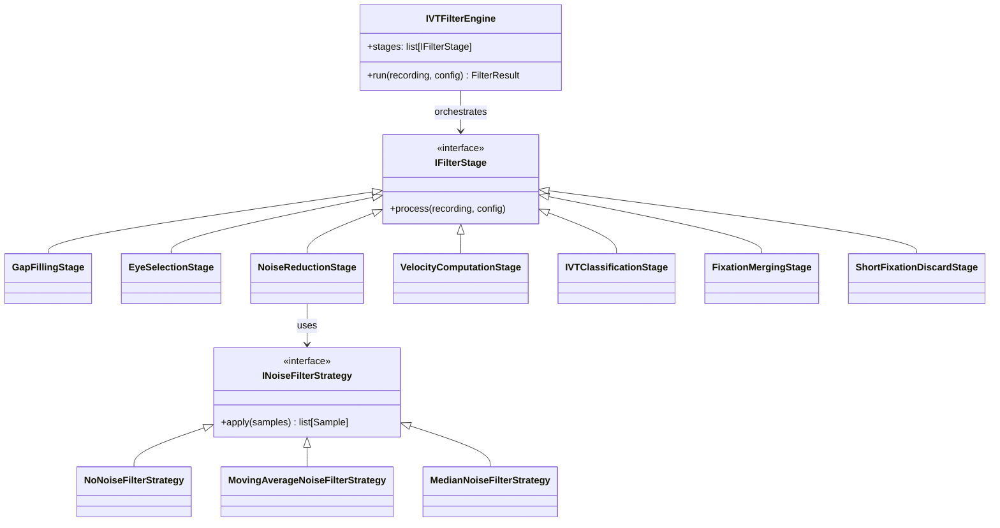
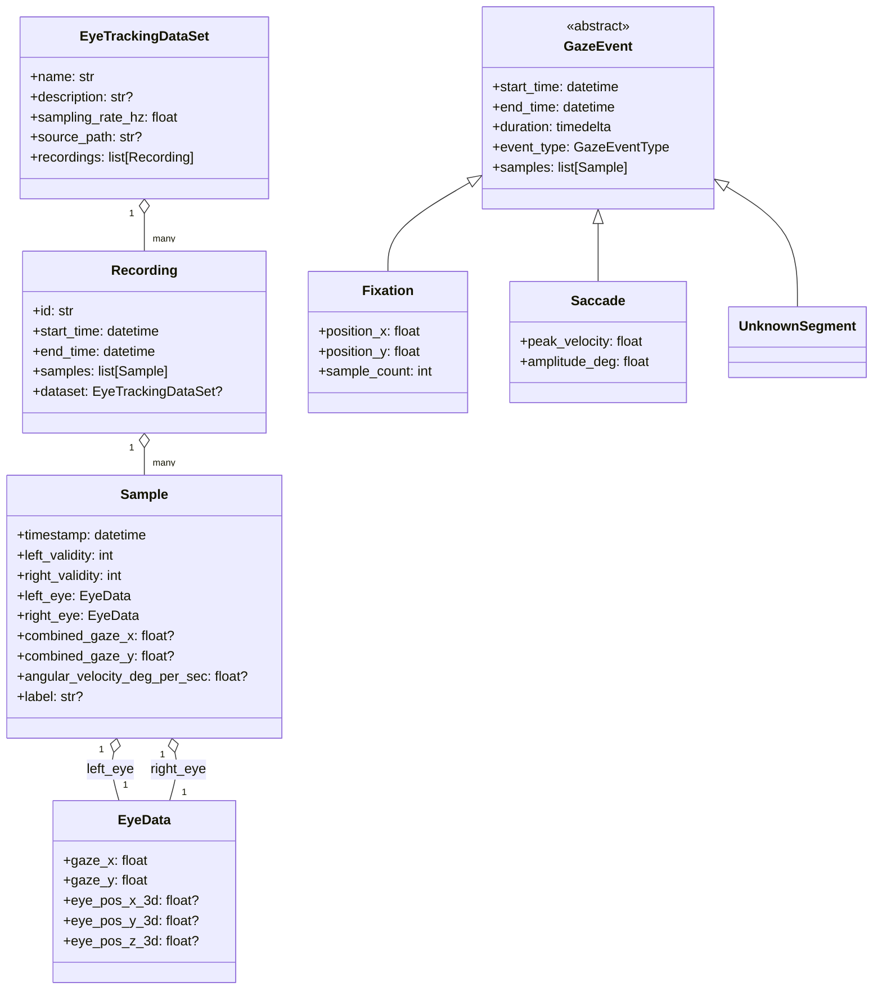

# IVT filter architecture

This library mirrors the seven-step pipeline described by Olsen's I-VT identification filter. Each step is represented by a dedicated stage class in `ivt_filter.stages` and executed sequentially by `IVTFilterEngine`.

## Pipeline overview

The pipeline is intentionally staged so each function in Olsen's Section 3.1 maps to one class. The default order constructed by `IVTFilterEngine` is:

1. **GapFillingStage** — interpolates short gaps in per-eye data.
2. **EyeSelectionStage** — combines binocular gaze according to `EyeSelectionMode`.
3. **NoiseReductionStage** — smooths gaze using a strategy object (none, moving average, median).
4. **VelocityComputationStage** — derives angular velocity over a centered temporal window.
5. **IVTClassificationStage** — applies the velocity threshold to label samples and assemble gaze events.
6. **FixationMergingStage** — merges adjacent fixations separated by short spatial/temporal gaps.
7. **ShortFixationDiscardStage** — removes fixations shorter than the minimum duration and relabels their samples as unknown.

### Class-level view of the pipeline

## Domain and event model

The domain model captures Tobii eye-tracking samples with explicit gaze and eye-position values for both eyes. It cleanly separates the raw input data from algorithmic stages.

## Stage responsibilities mapped to Olsen

- **GapFillingStage** — Implements gap fill-in (Olsen §3.1.1) by interpolating short invalid stretches per eye.
- **EyeSelectionStage** — Implements eye selection (Olsen §3.1.2) with LEFT, RIGHT, AVERAGE, and STRICT_AVERAGE modes.
- **NoiseReductionStage** — Implements noise reduction (Olsen §3.1.3) using a configurable filter strategy.
- **VelocityComputationStage** — Implements velocity calculation (Olsen §3.1.4) via angular distance over a centered window.
- **IVTClassificationStage** — Implements I-VT classification (Olsen §3.1.5) using the velocity threshold to label fixations and saccades.
- **FixationMergingStage** — Implements merging adjacent fixations (Olsen §3.1.6) when spatial/temporal gaps are small.
- **ShortFixationDiscardStage** — Implements discarding short fixations (Olsen §3.1.7) and relabeling their samples as unknown.

## Strategy pattern for noise

Noise reduction is abstracted behind `INoiseFilterStrategy`, allowing the pipeline to remain closed for modification but open for extension: new filters can be added without touching the stages themselves. The default is a pass-through `NoNoiseFilterStrategy`, with moving average and median filters provided as ready-made strategies.

## SOLID alignment

- **SRP**: each stage handles exactly one responsibility from Olsen's paper.
- **OCP/DIP**: the engine depends on the `IFilterStage` abstraction and the noise stage depends on `INoiseFilterStrategy`, enabling alternative implementations via dependency injection.
- **LSP/ISP**: protocols and abstract base classes define the minimal contracts that substitutions must honor.

## Usage notes

1. Construct an `IVTFilterConfiguration` with the desired eye-selection mode, velocity threshold, gap and fixation thresholds, and a noise strategy.
2. Load Tobii TSV data into a `Recording` (via the test helpers or your own loader) and pass it to `IVTFilterEngine.run(recording, config)`.
3. Consume the returned `FilterResult.events` to access fixations, saccades, and unknown segments along with timing and positional data suitable for further analytics or visualization.
